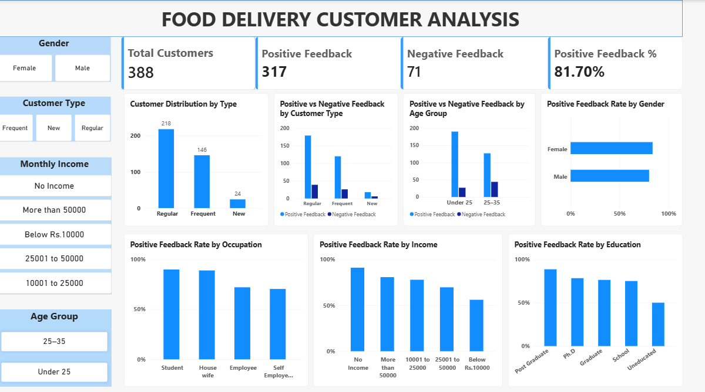

# Food Delivery Customer Analysis

## About the Project

I created this project to analyze customer data from an online food delivery dataset.

The main goal was to understand customer types, feedback, and how feedback changes across different customer groups such as age, gender, occupation, income, and education.

I used Power BI to clean, analyze and visualize the data and created an interactive dashboard.

## Tools Used

- Power BI
- PostgreSQL
- SQL
- CSV

## Dashboard

## What I Analyzed

- Customer distribution by customer type
- Positive and negative feedback
- Feedback by age group
- Feedback by gender
- Feedback by occupation
- Feedback by income
- Feedback by education

## Key Numbers

- Total Customers: 388
- Positive Feedback: 317
- Negative Feedback: 71
- Positive Feedback Rate: 81.70%
- ## Key Insights

- Regular customers are the largest customer group with 218 customers.
- 317 out of 388 customers gave positive feedback.
- The overall positive feedback rate is 81.70%.
- The dashboard shows differences in feedback rates across gender, occupation, income, and education groups.
- Customer type and demographic filters can be used to explore these patterns interactively.

## Files

- `Food_Delivery_Analysis.pbix` – Power BI dashboard
- `Food_Delivery_Customer_Analysis_Report.pdf` – Project report
- `online food delivery dataset.csv` – Dataset
- `dashboard.png` – Dashboard screenshot

## Next Step

I will add SQL analysis to this project using PostgreSQL.

## Author

Devendra Saini
